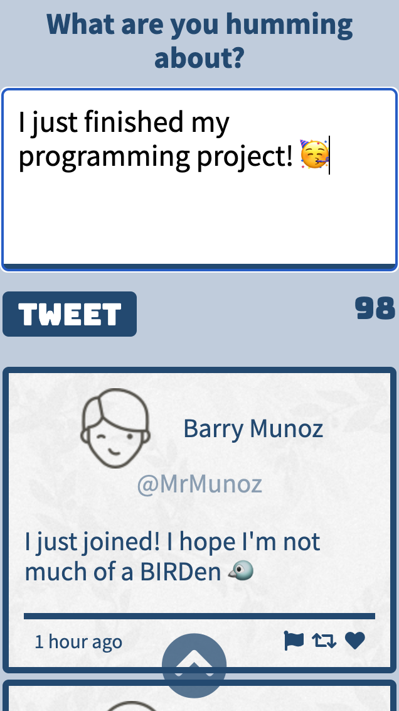

# Tweeter Project

Tweeter is a simple, single-page Twitter clone that runs on your local system.

I hope you're eggs-sighted to start Tweeting!

## Running Tweeter
### Twitter on a large screen

### Twitter on medium screens or tablets

### Twitter on small screens or mobile

## Features

- Share your tweets by posting them in the text box (under 140 characters, please!)
- Your tweets show up on the page without the need to refresh
- Your tweet comes with a time stamp so you'll never forget when you posted it
- If you start rambling on (longer than 140 characters) or forget to type in the box, Tweeter will catch you and not let you post
- Click the "Write a new tweet" button on the navigation bar to show or hide the text box
- Once you scroll down, a handle arrow will appear! Click it to get back to the top
- The responsive layout adapts to the size of your screen

## Dependencies

- Express
- Node 5.10.x or above
- body-parser
- MD5
- timeago

## Getting Started

- Clone the repository onto your local system.
- Install all dependencies using the `npm install` command.
- Run the development web server using the `npm run local` command.
- Open `http://localhost:8080/` in your browser.